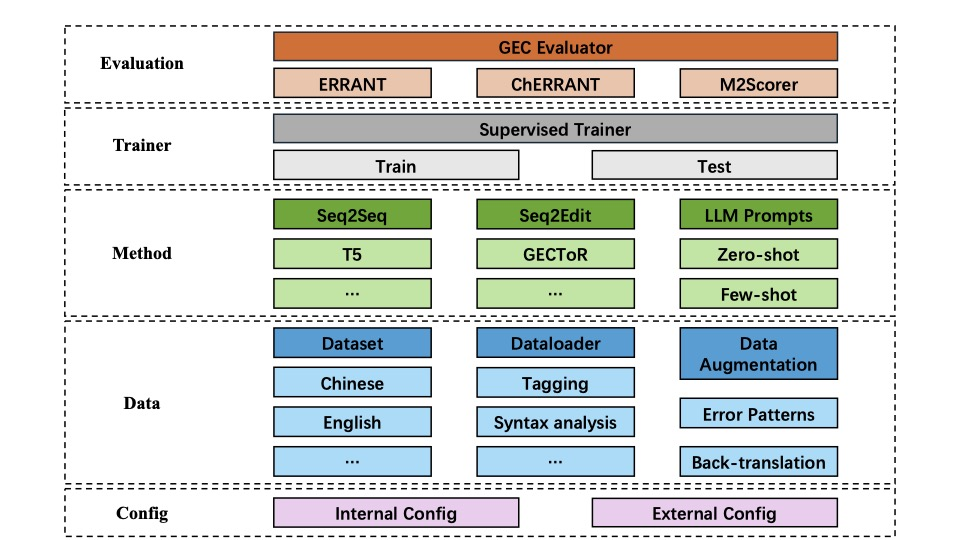

# UnifiedGEC: Integrating Grammatical Error Correction Approaches for Multi-languages with a Unified Framework

English | [简体中文](./README.md)


UnifiedGEC is an open-source, GEC-oriented framework, which integrates 5 GEC models of different architecture and 7 GEC datasets across different languages. The sturcture of our framework is shown in the picture. It provides abstract classes of dataset, dataloader, evaluator, model and trainer, allowing users to implement their own modules. This ensures excellent extensibility. 

Our framework is user-friendly, and users can train a model on a dataset with a single command. Moreover, users are able to deal with low-resource tasks with our proposed data augmentation module, or use given prompts to conduct experiments on LLMs.





## Characterisic

- **User-friendly**: UnifiedGEC provides users with a convenient way to use our framework. They can start training or inference easily with a command line specifying the model and dataset they need to use. They can also adjust parameters, or launch data augmentation or prompt modules through a single line of command.
- **Modularized and extensible**: UnifiedGEC consists of modules including dataset, dataloader, config and so on, and provides users with abstract classses of these modules. Users are allowed to implement their own modules through these classes.
- **Comprehensive**: UnifiedGEC has integrated 3 Seq2Seq models, 2 Seq2Edit models, 2 Chinese datasets, 2 English datasets and 3 datasets of other languages. We have conducted experiments on these datasets and evaluated the performance of integerated models, which provides users with a more comprehensive understanding of GEC tasks and models.


## Architecture

Complete structure of UnifiedGEC:

```
.
|-- gectoolkit  # main code of UnifiedGEC
    |-- config  # internal config and implementation of Config Class
    |-- data    # Abstract Class of Dataset and Dataloader, and implementation of GEC Dataloader
    |-- evaluate    # Abstract Class of Evaluator and implementation of GEC Evaluator
    |-- llm     # prompts for LLMs
    |-- model   # Abstract Class of Model and code of integrated models
    |-- module  # reusable modules (e.g., Transformer Layer)
    |-- properties  # detailed external config of each model
    |-- trainer # Abstract Class of Trainer and implementation of SupervisedTrainer
    |-- utils   # other tools used in our framework
    |-- quick_start.py      # code for launching the framework
|-- log         # logs of training process
|-- checkpoint  # results and checkpoints of training process
|-- dataset     # preprocessed datasets in JSON format
|-- augmentation    # data augmentation module
    |-- data    # dependencies of error patterns
    |-- noise_pattern.py    # code of error patterns
    |-- translation.py      # code of back-translation
|-- evaluation  # evaluation module
    |-- m2scorer    # M2Scorer, for NLPCC18、CoNLL14、FCE
    |-- errant      # ERRANT, for AKCES、Falko-MERLIN、Cowsl2h
    |-- cherrant    # ChERRANT, for MuCGEC
    |-- convert.py  # script for convert output JSON file into corresponding format
|-- run_gectoolkit.py       # code for launching the framework
```

### Models

We integrated **5** GEC models in our framework, which can be divided into two categories: **Seq2Seq** models and **Seq2Edit** models, as shown in table:

<table align="center">
  	<thead>
        <tr>
            <th align="center">type</th>
            <th align="center">model</th>
            <th align="center">reference</th>
        </tr>
    </thead>
    <tbody>
        <tr>
            <td rowspan="3" align="center">Seq2Seq</td>
            <td align="center">Transformer</td>
            <td align="center"><a href="https://arxiv.org/abs/1706.03762">(Vaswani et al., 2017)</a></td>
        </tr>
        <tr>
            <td align="center">T5</td>
            <td align="center"><a href="https://aclanthology.org/2021.naacl-main.41/">(Xue et al., 2021)</a></td>
        </tr>
        <tr>
            <td align="center">SynGEC</td>
            <td align="center"><a href="https://arxiv.org/abs/2210.12484">(Zhang et al., 2022)</a></td>
        </tr>
        <tr>
            <td rowspan="2" align="center">Seq2Edit</td>
            <td align="center">Levenshtein Transformer</td>
            <td align="center"><a href="https://arxiv.org/abs/1905.11006">(Gu et al., 2019)</a></td>
        </tr>
        <tr>
            <td align="center">GECToR</td>
            <td align="center"><a href="https://aclanthology.org/2020.bea-1.16/">(Omelianchuk et al., 2020)</a></td>
        </tr>
    </tbody>
</table>


### Datasets

We integrated **7** datasets of different languages in our framework, including Chinese, English, Spanish, Czech and German:

<table align="center">
  	<thead>
       <tr>
            <th align="center">dataset</th>
            <th align="center">language</th>
            <th align="center">reference</th>
        </tr>
    </thead>
    <tbody>
        <tr>
            <td align="center">FCE</td>
            <td align="center">English</td>
            <td align="center"><a href="https://aclanthology.org/P11-1019/">(Yannakoudakis et al., 2011)</a></td>
        </tr>
        <tr>
            <td align="center">CoNLL14</td>
          	<td align="center">English</td>
            <td align="center"><a href="https://aclanthology.org/W14-1701/">(Ng et al., 2014)</a></td>
        </tr>
        <tr>
            <td align="center">NLPCC18</td>
          	<td align="center">Chinese</td>
            <td align="center"><a href="https://link.springer.com/chapter/10.1007/978-3-319-99501-4_41">(Zhao et al., 2018)</a></td>
        </tr>
        <tr>
            <td align="center">MuCGEC</td>
            <td align="center">Chinese</td>
            <td align="center"><a href="https://aclanthology.org/2022.naacl-main.227/">(Zhang et al., 2022)</a></td>
        </tr>
        <tr>
            <td align="center">COWSL2H</td>
            <td align="center">Spanish</td>
            <td align="center"><a href="https://ricl.aelinco.es/index.php/ricl/article/view/109">(Yamada et al., 2020)</a></td>
        </tr>
      	<tr>
            <td align="center">Falko-MERLIN</td>
            <td align="center">German</td>
            <td align="center"><a href="http://www.lrec-conf.org/proceedings/lrec2014/pdf/606_Paper.pdf">(Boyd et al., 2014)</a></td>
        </tr>
      	<tr>
            <td align="center">AKCES-GEC</td>
            <td align="center">Czech</td>
            <td align="center"><a href="https://arxiv.org/abs/1910.00353">(Náplava et al., 2019)</a></td>
        </tr>
    </tbody>
</table>

Datasets integrated in UnifiedGEC are in JSON format:

```json
[
    {
        "id": 0,
        "source_text": "My town is a medium size city with eighty thousand inhabitants .",
        "target_text": "My town is a medium - sized city with eighty thousand inhabitants ."
    }
]
```

Our preprocessed datasets can download [here](https://drive.google.com/file/d/1UwQQRHW7ueadlQ3Nc8hZNKpklZJLdjaW/view?usp=sharing).

### 

## Quick Start

### Installation

We use Python 3.8 in our experiments. Please install allennlp 1.3.0 first, then install other dependencies:

```shell
pip install allennlp==1.3.0
pip install -r requirements.txt
```

Note: Errors may occur while installing jsonnet with `pip`. Users are suggested to use `conda install jsonnet` to finish installation.

### Usage

Please create directories for logs and checkpoints before using our framework:

```shell
mkdir log
mkdir checkpoint
```

Users can launch our framework through command line:

```shell
python run_gectoolkit.py -m $MODEL_NAME -d $DATASET_NAME
```

Refer to `./gectoolkit/config/config.json` for parameters related to training process, such as number of epochs, learning rate. Refer to `./gectoolkit/properties/models/` for detailed parameters of each model.

Models except Transformer require pre-trained models, so please download them and store them in the corresponding model directory under `./gectoolkit/properties/models/`. We provide download links for some of pre-trained models, and users can also download them from Huggingface.

UnifiedGEC also support adjusting parameters via command line:

```shell
python run_gectoolkit.py -m $MODEL_NAME -d $DATASET_NAME --learning_rate $LR
```

### Adding New Datasets

Our framework allows users to add new datasets. The new dataset folder `dataset_name/` should include three json files of train set, valid set and test set, and users need to place the folder in the `dataset/` directory:

```
dataset
    |-- dataset_name
        |-- trainset.json
        |-- validset.json
        |-- testset.json
```

After that, users also need to add a configuration file `dataset_name.json` in the `gectoolkit/properties/dataset` directory, and the contents of the file can refer to other files in the same directory.

### Data Augmentation Module

We provide users with two data augmentation methods (for Chinese and English):

- error patterns: add noises randomly to sentences
- back-translation: translate sentences into the other language, and then translate back to origin language

Users can use `augment` in command line to use our data augmentation module, and `noise` and `translation` are available values:

```shell
python run_gectoolkit.py -m $MODEL_NAME -d $DATASET_NAME --augment noise
```

Upon first use, our framework will generate augmented data and save the datasets in the local file, and the back-translation method requires a certain amount of time. UnifiedGEC will use generated data directly while subsequent executions.

### Prompts

We also provide prompts for LLMs (for Chinese and English), including zero-shot prompts and few-shot prompts. 

Users can use prompts with `use_llm` in command lines，and specify the number of in-context learning examples with argument `example_num`.

```shell
python run_gectoolkit.py -m $MODEL_NAME -d $ DATASET_NAME --use_llm --example_num $EXAMPLE_NUM
```

Model name used here should be those from huggingface, such as `Qwen/Qwen-7B-chat`.

### Evaluation

We integrate mainstream evaluation tools for GEC tasks in our evaluation module, including M2Scorer, ERRANT and ChERRANT. Additionally, we also provide scripts for converting and ground truth of some datasets. During the process of training, UnifiedGEC calculate micro-level PRF for the results of models, so if users want to evaluate models in a macro way, they can use this evaluation module.

First, users should use our provided script to convert outputs of the models to the format required by scorers:

```shell
python convert.py --predict_file $PREDICT_FILE --dataset $DATASET
```

Correspondence between datasets and scorers:

<table align="center">
  <thead>
    <tr>
      <th align="center">数据集</th>
      <th align="center">评估工具</th>
    </tr>
  </thead>
  <tbody>
    <tr>
      <td align="center">CoNLL14、FCE、NLPCC18</td>
      <td align="center">M2Scorer</td>
    </tr>
    <tr>
      <td align="center">AKCES-GEC、Falko-MERLIN、COWSL2H</td>
      <td align="center">ERRANT</td>
    </tr>
    <tr>
      <td align="center">MuCGEC</td>
      <td align="center">ChERRANT</td>
    </tr>
  </tbody>
</table>

#### M2Scorer

Official repository: https://github.com/nusnlp/m2scorer

For English datasets (CoNLL14、FCE)，use M2scorer directly for evaluation：

```shell
cd m2scorer
m2scorer/m2scorer predict.txt m2scorer/conll14.gold
```

For Chinese datasets (NLPCC18)，**pkunlp tools for segmentation is required**. We also provide converting scripts:

```shell
cd m2scorer
python pkunlp/convert_output.py --input_file predict.txt --output_file seg_predict.txt
m2scorer/m2scorer seg_predict.txt m2scorer/nlpcc18.gold
```

#### ERRANT

Official repository: https://github.com/chrisjbryant/errant

Usage is referenced from official repository:

```shell
cd errant
errant_parallel -orig source.txt -cor target.txt -out ref.m2
errant_parallel -orig source.txt -cor predict.txt -out hyp.m2
errant_compare -hyp hyp.m2 -ref ref.m2
```

#### ChERRANT

Official repository: https://github.com/HillZhang1999/MuCGEC

Usage is referenced from official repository:

```shell
cd cherrant/ChERRANT
python parallel_to_m2.py -f ../hyp.txt -o hyp.m2 -g char
python compare_m2_for_evaluation.py -hyp hyp.m2 -ref ref.m2
```


## Experiment Results

### Models

There are 5 models and 7 datasets across different languages integrated in UnifiedGEC, and there is the best performance of implemented models on Chinese and English datasets:

<table align="center">
  <thead>
    <tr>
      <th rowspan="3" align="center">model</th>
      <th colspan="12" align="center">dataset</th>
    </tr>
    <tr>
      <th colspan="3" align="center">CoNLL14(EN)</th>
      <th colspan="3" align="center">FCE(EN)</th>
      <th colspan="3" align="center">NLPCC18(ZH)</th>
      <th colspan="3" align="center">MuCGEC(ZH)</th>
      </tr>
    <tr>
      <th align="center">P</th>
      <th align="center">R</th>
      <th align="center">F0.5</th>
      <th align="center">P</th>
      <th align="center">R</th>
      <th align="center">F0.5</th>
      <th align="center">P</th>
      <th align="center">R</th>
      <th align="center">F0.5</th>
      <th align="center">P</th>
      <th align="center">R</th>
      <th align="center">F0.5</th>
    </tr>
  </thead>
  <tbody>
    <tr>
      <td align="center">Levenshtein Transformer</td>
      <td align="center">13.5</td>
      <td align="center">12.6</td>
      <td align="center">13.3</td>
      <td align="center">6.3</td>
      <td align="center">6.9</td>
      <td align="center">6.4</td>
      <td align="center">12.6</td>
      <td align="center">8.5</td>
      <td align="center">10.7</td>
      <td align="center">6.6</td>
      <td align="center">6.4</td>
      <td align="center">6.6</td>
    </tr>
    <tr>
      <td align="center">GECToR</td>
      <td align="center">52.3</td>
      <td align="center">21.7</td>
      <td align="center">40.8</td>
      <td align="center">36.0</td>
      <td align="center">20.7</td>
      <td align="center">31.3</td>
      <td align="center">30.9</td>
      <td align="center">20.9</td>
      <td align="center">28.2</td>
      <td align="center">33.5</td>
      <td align="center">19.1</td>
      <td align="center">29.1</td>
    </tr>
    <tr>
      <td align="center">Transformer</td>
      <td align="center">24.1</td>
      <td align="center">15.5</td>
      <td align="center">21.7</td>
      <td align="center">20.8</td>
      <td align="center">15.9</td>
      <td align="center">19.6</td>
      <td align="center">22.3</td>
      <td align="center">20.8</td>
      <td align="center">22.0</td>
      <td align="center">19.7</td>
      <td align="center">9.2</td>
      <td align="center">16.0</td>
    </tr>
    <tr>
      <td align="center">T5</td>
      <td align="center">36.6</td>
      <td align="center">39.5</td>
      <td align="center">37.1</td>
      <td align="center">29.2</td>
      <td align="center">29.4</td>
      <td align="center">29.3</td>
      <td align="center">32.5</td>
      <td align="center">21.1</td>
      <td align="center">29.4</td>
      <td align="center">30.2</td>
      <td align="center">14.4</td>
      <td align="center">24.8</td>
    </tr>
    <tr>
      <td align="center">SynGEC</td>
      <td align="center">50.6</td>
      <td align="center">51.8</td>
      <td align="center">50.9</td>
      <td align="center">59.5</td>
      <td align="center">52.7</td>
      <td align="center">58.0</td>
      <td align="center">36.0</td>
      <td align="center">36.8</td>
      <td align="center">36.2</td>
      <td align="center">22.3</td>
      <td align="center">26.2</td>
      <td align="center">23.6</td>
    </tr>
  </tbody>
</table>

The best performance of implemented models on datasets of other languages:

<table align="center">
  <thead>
    <tr>
      <th rowspan="3" align="center">model</th>
      <th colspan="9" align="center">dataset</th>
    </tr>
    <tr>
      <th colspan="3" align="center">AKCES-GEC(CS)</th>
      <th colspan="3" align="center">Falko-MERLIN(DE)</th>
      <th colspan="3" align="center">COWSL2H</th>     
    </tr>
    <tr>
      <th align="center">P</th>
      <th align="center">R</th>
      <th align="center">F0.5</th>
      <th align="center">P</th>
      <th align="center">R</th>
      <th align="center">F0.5</th>
      <th align="center">P</th>
      <th align="center">R</th>
      <th align="center">F0.5</th>
      </tr>
  </thead>
  <tbody>
    <tr>
      <td align="center">Levenshtein Transformer</td>
      <td align="center">4.4</td>
      <td align="center">5.0</td>
      <td align="center">4.5</td>
      <td align="center">2.3</td>
      <td align="center">4.2</td>
      <td align="center">2.5</td>
      <td align="center">1.9</td>
      <td align="center">2.3</td>
      <td align="center">2.0</td>
    </tr>
    <tr>
      <td align="center">GECToR</td>
      <td align="center">46.8</td>
      <td align="center">8.9</td>
      <td align="center">25.3</td>
      <td align="center">50.8</td>
      <td align="center">20.5</td>
      <td align="center">39.2</td>
      <td align="center">24.4</td>
      <td align="center">12.9</td>
      <td align="center">20.7</td>
    </tr>
    <tr>
      <td align="center">Transformer</td>
      <td align="center">44.4</td>
      <td align="center">23.6</td>
      <td align="center">37.8</td>
      <td align="center">33.1</td>
      <td align="center">18.7</td>
      <td align="center">28.7</td>
      <td align="center">11.8</td>
      <td align="center">15.0</td>
      <td align="center">12.3</td>
    </tr>
    <tr>
      <td align="center">T5</td>
      <td align="center">52.5</td>
      <td align="center">40.5</td>
      <td align="center">49.6</td>
      <td align="center">47.4</td>
      <td align="center">50.0</td>
      <td align="center">47.9</td>
      <td align="center">53.7</td>
      <td align="center">39.1</td>
      <td align="center">49.9</td>
    </tr>
    <tr>
      <td align="center">SynGEC</td>
      <td align="center">21.9</td>
      <td align="center">27.6</td>
      <td align="center">22.8</td>
      <td align="center">32.2</td>
      <td align="center">33.4</td>
      <td align="center">32.4</td>
      <td align="center">9.3</td>
      <td align="center">18.8</td>
      <td align="center">10.3</td>
    </tr>
  </tbody>
</table>

### Data Augmentation

We conduct experiments on NLPCC18 and CoNLL14 datasets, and simulate low-resource cases by choosing 10% data from datasets (F0.5/**delta F0.5**):

<table align="center">
    <thead>
        <tr>
            <th rowspan="3" align="center">model</th>
            <th rowspan="3" align="center">data augmentation methods</th>
            <th colspan="4" align="center">dataset</th>
        </tr>
      	<tr>
          	<th colspan="2" align="center">CoNLL14</th>
          	<th colspan="2" align="center">NLPCC18</th>
      	</tr>
      	<tr>
          	<th align="center">F0.5</th>
          	<th align="center">delta</th>
          	<th align="center">F0.5</th>
          	<th align="center">delta</th>
      	</tr>
    </thead>
    <tbody>
        <tr>
            <td rowspan="3" align="center">Levenshtein Transformer</td>
            <td align="center">w/o augmentation</td>
            <td align="center">9.5</td>
          	<td align="center">-</td>
          	<td align="center">6.0</td>
          	<td align="center">-</td>
        </tr>
        <tr>
            <td align="center">w/ error patterns</td>
            <td align="center">6.4</td>
          	<td align="center">-3.1</td>
          	<td align="center">4.9</td>
          	<td align="center">-1.1</td>
        </tr>
        <tr>
            <td align="center">w/ back-translation</td>
            <td align="center">12.5</td>
          	<td align="center">3.0</td>
	          <td align="center">5.9</td>
          	<td align="center">-0.1</td>
        </tr>
      	<tr>
            <td rowspan="3" align="center">GECToR</td>
            <td align="center">w/o augmentation</td>
            <td align="center">14.2</td>
          	<td align="center">-</td>
          	<td align="center">17.4</td>
          	<td align="center">-</td>
        </tr>
        <tr>
            <td align="center">w/ error patterns</td>
            <td align="center">15.1</td>
          	<td align="center">0.9</td>
          	<td align="center">19.9</td>
          	<td align="center">2.5</td>
        </tr>
        <tr>
            <td align="center">w/ back-translation</td>
            <td align="center">16.7</td>
          	<td align="center">2.5</td>
	          <td align="center">19.4</td>
          	<td align="center">2.0</td>
        </tr>
      	<tr>
            <td rowspan="3" align="center">Transformer</td>
            <td align="center">w/o augmentation</td>
            <td align="center">12.6</td>
          	<td align="center">-</td>
          	<td align="center">9.5</td>
          	<td align="center">-</td>
        </tr>
        <tr>
            <td align="center">w/ error patterns</td>
            <td align="center">14.5</td>
          	<td align="center">1.9</td>
          	<td align="center">9.9</td>
          	<td align="center">0.4</td>
        </tr>
        <tr>
            <td align="center">w/ back-translation</td>
            <td align="center">16.6</td>
          	<td align="center">4.0</td>
	          <td align="center">10.4</td>
          	<td align="center">0.9</td>
        </tr>
      	<tr>
            <td rowspan="3" align="center">T5</td>
            <td align="center">w/o augmentation</td>
            <td align="center">31.7</td>
          	<td align="center">-</td>
          	<td align="center">26.3</td>
          	<td align="center">-</td>
        </tr>
        <tr>
            <td align="center">w/ error patterns</td>
            <td align="center">32.0</td>
          	<td align="center">0.3</td>
          	<td align="center">27.0</td>
          	<td align="center">0.7</td>
        </tr>
        <tr>
            <td align="center">w/ back-translation</td>
            <td align="center">32.2</td>
          	<td align="center">0.5</td>
	          <td align="center">24.1</td>
          	<td align="center">-2.2</td>
        </tr>
      	<tr>
            <td rowspan="3" align="center">SynGEC</td>
            <td align="center">w/o augmentation</td>
            <td align="center">47.7</td>
          	<td align="center">-</td>
          	<td align="center">32.4</td>
          	<td align="center">-</td>
        </tr>
        <tr>
            <td align="center">w/ error patterns</td>
            <td align="center">48.2</td>
          	<td align="center">0.5</td>
          	<td align="center">34.9</td>
          	<td align="center">2.5</td>
        </tr>
        <tr>
            <td align="center">w/ back-translation</td>
            <td align="center">47.7</td>
          	<td align="center">0.0</td>
	          <td align="center">34.6</td>
          	<td align="center">2.2</td>
        </tr>
    </tbody>
</table>

### Prompts

We use `Qwen1.5-14B-chat` and `Llama2-7B-chat` and conduct experiments on NLPCC18 and CoNLL14 datasets (P/R/F0.5):

<table align="center">
	<thead>
    <tr>
    	<th rowspan="3" align="center">Setting</th>
      <th colspan="6" align="center">Dataset</th>
    </tr>
    <tr>
      <th colspan="3" align="center">CoNLL14</th>
      <th colspan="3" align="center">NLPCC18</th>
    </tr>
    <tr>
      <th align="center">P</th>
      <th align="center">R</th>
      <th align="center">F0.5</th>
      <th align="center">P</th>
      <th align="center">R</th>
      <th align="center">F0.5</th>
    </tr>
  </thead>
  <tbody>
    <tr>
      <td align="center">zero-shot</td>
      <td align="center">48.8</td>
      <td align="center">49.1</td>
      <td align="center">48.8</td>
      <td align="center">24.7</td>
      <td align="center">38.3</td>
      <td align="center">26.6</td>
    </tr>
    <tr>
      <td align="center">few-shot</td>
      <td align="center">50.4</td>
      <td align="center">50.2</td>
      <td align="center">50.4</td>
      <td align="center">24.8</td>
      <td align="center">39.8</td>
      <td align="center">26.8</td>
    </tr>
  </tbody>
</table>


## License

UnifiedGEC uses [Apache 2.0 License](./LICENSE).

